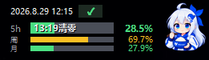

# Deepcode 用量小组件（DeepcodeUsage）

一个透明的桌面小组件，实时显示 Deepcode（deepcode.vegamo.cn）订阅套餐用量，并附带本地会话的 token 消耗统计。

---

## 功能

- **实时用量**：显示 **5h / 周 / 月** 三个额度的使用百分比和进度条
- **清零时间**：5h 进度条上直接显示下次清零时间（如 `02:19清零`）
- **吉祥物表情**：按 5h **剩余百分比**自动切换 20 档表情（剩余越多越开心，快用完则崩溃）
- **消耗统计**：切换查看**月消耗 / 今日消耗**（单位：万）及 命中-未命中-输出 比例
- **费用估算**：按 DeepSeek 官网峰谷定价估算**本月 / 今日费用**（¥）
- **透明背景**：无边框、内容直接浮在桌面上
- **可拖动**：按住进度条区域或顶部即可移动窗口
- **图钉置顶** / **小人设置 token** / **关闭**：悬停到左上角按钮区域时显示

## 使用方法

### 1. 设置登录 token（首次运行）
程序本身**不内置任何 token**（避免泄露），首次启动会自动弹出设置框：

1. 用浏览器登录 [deepcode.vegamo.cn](https://deepcode.vegamo.cn)
2. 按 `F12` 打开开发者工具 → `Console`
3. 输入并回车：`localStorage.getItem('deepcode_token')`
4. 把返回的字符串粘贴到设置框的输入框中保存

> token 保存在用户目录 `~/.deepcode/usage_log.json`，**重启自动读取，无需重复输入**。
> token 过期时状态会显示红色 ✗，重新设置即可恢复。

### 2. 操作说明
| 操作 | 效果 |
| --- | --- |
| 单击进度条区域 | 切换「5h/周/月用量」↔「月消耗/今日消耗/费用」 |
| 双击进度条区域 / 吉祥物 | 开关吉祥物显示 |
| 按住并拖动 | 移动窗口 |
| 悬停左上角 | 显示：📌 图钉（置顶）、👤 设置 token、✕ 关闭 |

### 3. 消耗统计说明
- 数据来自本机 Deep Code CLI 的会话记录（`~/.deepcode/projects/`）
- 「月消耗 / 今日消耗」为本地 token 统计（命中 / 未命中 / 输出），`万` 为单位
- 今日/本月消耗与费用均为**增量统计**：首次打开从 0 开始，跨日/跨月自动归档并重置
- 基线日志保存在用户目录 `~/.deepcode/usage_log.json`（不随 exe 走，关闭重开可续）
- 换电脑时需同步 `.deepcode` 目录，否则从新机器的本地数据重新累计

### 4. 费用估算规则
- 按 DeepSeek 官网定价估算（元/百万 tokens）：
  - **v4-flash**：空闲 命中 0.02 / 未命中 1.0 / 输出 4.0；高峰 ×2
  - **v4-pro**：空闲 命中 0.15 / 未命中 4.5 / 输出 13.5；高峰 ×2
- **高峰时段**：仅工作日（周一~周五）北京时间 9:00-12:00、14:00-18:00；其余（含周末/节假日）为谷价
- 费用为**估算值**，按刷新时刻的峰谷价计算，仅供参考

### 5. 常见问题
**Q：调用本地部署的 API 时，消耗统计为 0？**
正常现象。token 统计依赖模型 API 返回的 `usage` 字段：
- 官方 DeepSeek API 返回标准 `usage`（prompt / cached / completion tokens）→ 可正常统计 ✅
- 本地部署（Ollama / vLLM / LM Studio 等）多数**不返回 usage 或返回为空** → Deep Code 无数据可记 → 统计为 0 ❌

此时 **5h / 周 / 月 进度条仍正常**（来自平台订阅 API，与模型后端无关）。

---

## 版本更新

- **V1.5.1（2026-09-09 · 当前版本）**
  - 更新 v4-flash 官方新定价：空闲 命中0.02 / 未命中1.0 / 输出4.0，高峰×2（Pro 不变）

- **V1.5.0（2026-09-05）**
  - token 设置弹窗单例：反复点小人只弹一个窗口
  - 消耗窗口按 DeepSeek 官网峰谷定价自动计算金额（本月/今日费用）
  - 峰价仅工作日（周一~周五）9-12、14-18；周末/节假日谷价半价
  - 费用按 v4-flash 官方价直接计算（命中/未命中/输出），不虚高
  - token 保存到用户目录 `~/.deepcode/usage_log.json`，重启自动读取免输入
  - 启动即读取 token 并立即刷新（不再等一分钟）

- **V1.4.1（2026-08-31）**
  - 消耗统计改为「累计增量 + 本地基线日志」：今日/本月从 0 开始，只统计实际增量
  - 跨日/跨月自动把上一期消费量记入日志历史，关闭重开同一天可保留进度
  - 消耗日志保存在用户目录 `~/.deepcode/usage_log.json`（不随 exe 走）

- **V1.4.0（2026-08-31）**
  - 吉祥物隐藏时，组件右边界收缩到去掉吉祥物的新边界（可贴合屏幕右缘）
  - token 弹窗默认屏幕居中
  - 移除 token 弹窗的深浅色切换
  - 进度条改为直角，低百分比精确显示（1% 就是 1%，不被圆角虚增）
  - 5h / 周 / 月 名称与数字和各自进度条中心对齐；周 / 月名称上移 2px

- **V1.3.0（2026-08-29）**
  - 修复多屏拖动：小组件可拖到第二个显示器
  - 亮背景可读性：时间 / 5h/周/月 / 数字加深色描边，吉祥物加深色轮廓环
  - token 弹窗支持深色 / 浅色切换

- **V1.2.0（260829 · 初始版本）**
  - 初始版本
